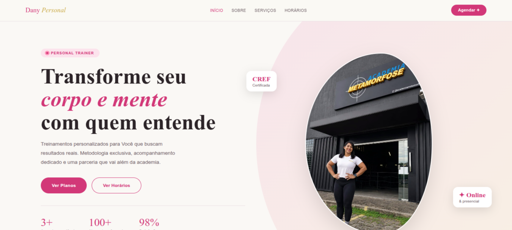

# 💪 Personal Dany


> Landing page moderna para apresentação de serviços de personal trainer, com foco em experiência mobile, design elegante e conversão via WhatsApp.

🔗 **Deploy:** https://personal-trainer-dany.vercel.app/  
💻 **Repositório:** https://github.com/AllefRamos14/Personal-Trainer-Dany-.git

---

## 📸 Preview



---

## 🧠 Sobre o projeto

O **Personal Dany** é uma landing page desenvolvida para promover serviços de treinamento personalizado. O projeto foi construído com foco em:

- 📱 Experiência fluida em dispositivos móveis
- ✨ Design elegante e profissional
- 💬 Conversão direta via WhatsApp
- ⚛️ Estrutura escalável com React

---

## ⚙️ Tecnologias

| Tecnologia | Uso |
|---|---|
| ⚛️ React 19 | Interface declarativa |
| ⚡ Vite | Build ultrarrápido |
| 🎨 Styled-components | CSS-in-JS |
| 🔀 React Router DOM | Navegação SPA |
| 🧹 Biome | Lint + format |
| 🚀 Vercel | Deploy contínuo |

---

## 📂 Estrutura do projeto

```
personal-dany/
├── public/
│   └── ginastica.webp
├── src/
│   ├── components/
│   ├── pages/
│   ├── styles/
│   └── main.jsx
├── index.html
├── vite.config.js
└── package.json
```


---

## 🚀 Como rodar localmente

```bash
# clone o repositório
git clone https://github.com/SEU-USUARIO/personal-dany.git

# instale as dependências
npm install

# rode o servidor de desenvolvimento
npm run dev
```

---

## 📄 Licença

Este projeto está sob a licença **MIT**. Veja o arquivo [LICENSE](LICENSE) para mais detalhes.

---

<p align="center">Feito com 💪 por <a href="https://github.com/SEU-USUARIO">Dany</a></p>
